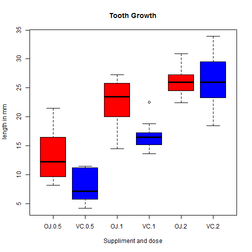

<style>
.footer{
color: black;
background: #E8E8E8;
position:fixed;
top:90%
text-align:center;
width:100%
}
</style>


Tooth Growth Comparison Shiny Web Application
========================================================
author: Chin Teck, Chong
date: March 03, 2016
transition:rotate


This is part of Assignment on Coursera Developing Data Products 
Full Shiny app described in this presentation available at 
https://chinteck07.shinyapps.io/Tooth_App/


Orange Juice vs. Ascorbic Acid, Which one better for tooth growth?
========================================================
Exploring the length of Odontoblasts (cells responsible for tooth growth) at different dose levels across 2 type of Vitamin C (Orange Juice coded as OC and Ascorbic acid coded as VC)
- 60 guinea pigs been selected
- Each of this received one of three dose levels of vitamin C (0.5, 1, and 2 mg/day) 

For more details, click [link](http://jn.nutrition.org/content/33/5/491.full.pdf) to the pdf file of the original 1947 paper describing this experiment. 

Apps Instruction
========================================================
transition:rotate

User can select different dose levels of vitamin C to observe the comparison of the odontoblasts length on 2 type of vitamin C. 

Average of odontoblasts length will be displayed according to the dose levels selection of vitamin C

Data table or raw data will be available as well. 


Apps Interpretation & Result
========================================================
User will observe different level of dose will have different impact on the odontoblasts growth length. 

The details discussion and interpretation can be viewed through below link:
http://rpubs.com/chinteck07/ToothGrowthVicC


Sample App Output
========================================================


***

```
   len supp dose
1  4.2   VC  0.5
2 11.5   VC  0.5
3  7.3   VC  0.5
4  5.8   VC  0.5
5  6.4   VC  0.5
6 10.0   VC  0.5
```

```
$estimate
mean in group OJ mean in group VC 
        20.66333         16.96333 
```

